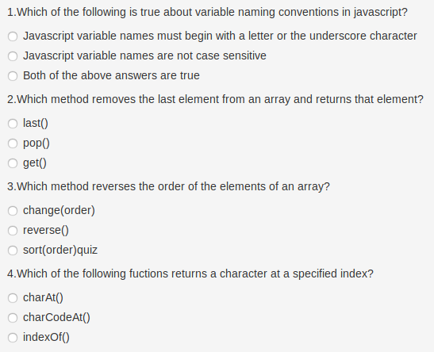
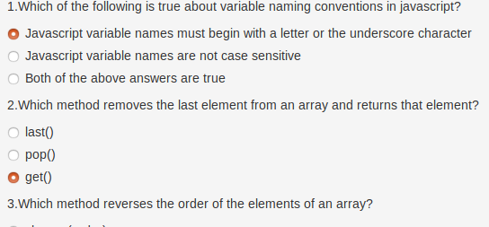
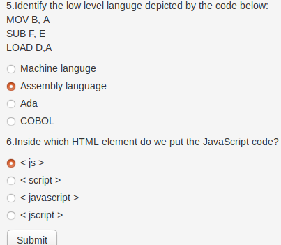
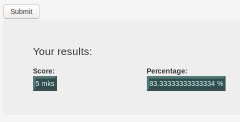

# Quiz Board
## Description
Quiz board is an application that allows the user to take a multiple choice test and the results of the test displayed on the webpage on submission of the answers.
## Author
Rees Alumasa

## Set Up Requirements
* A Mobile phone, PC, Desktop or any other supported PDA.
* Internet connectivity.
* A web browser. Most rated; Chrome and Firefox
* Application Link to be run: https://Rees5.github.io/quiz-board

## BDD
| Behaviour | Example Layout |
| --- | --- |
| 1.The application displays multiple   choice questions |  |
| 2.The application allows for selection of only   one answer per question that the user thinks is correct   from the multiple answers provided |  |
| 3.The application allows the user to submit   answers when through with the quiz |  |
| 4.The aplplication returns the score of the user   on the website when the user submits the answers |  |

## Technologies Used
 **Languages**
 * JavaScript
  * JQ
  * JS
 * HTML
 * CSS
  * CSS
  * bootsrap

**Aplications**
* Atom
* Terminal
* Github

## Contact Information
* Tel: +254792756002
* Email: reesalumasa@gmail.com
* Website: https://reestv.yolasite.com

## Copyright and Licence
* MIT LICENSE
* Copyright (c) 2019 Rees Alumasa
