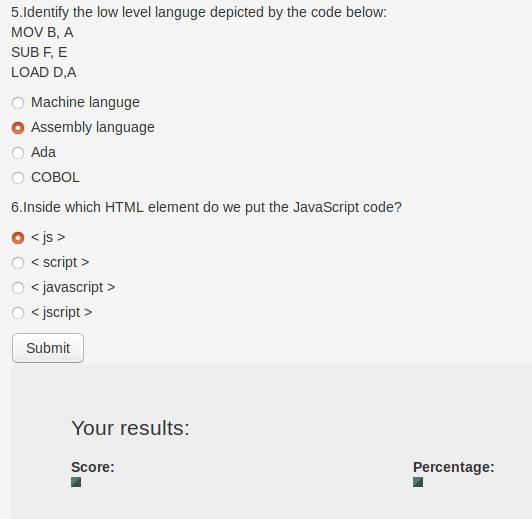

# Quiz Board
## Description
Quiz board is an application that allows the user to take a multiple choice test and the results of the test displayed on the webpage on submission of the answers.
## Author
[Rees Alumasa](https://github.com/Rees5)

## Set Up Requirements
* A Mobile phone, PC, Desktop or any other supported PDA.
* Internet connectivity.
* A web browser. Most rated; Chrome and Firefox
* Application Link to be run: https://Rees5.github.io/quiz-board
## Installation
Set-up quiz board locally by cloning this repository using the procedure below:

   * `*git clone https://github.com/Rees5/quiz-board*`
   * `*cd quiz-board*`
   * `*atom .*`

## BDD
| Behaviour | Example Layout |
| --- | --- |
| 1.The application displays multiple   choice questions |  |
| 2.The application allows for selection of only   one answer per question that the user thinks is correct   from the multiple answers provided |  |
| 3.The application allows the user to submit   answers when through with the quiz |  |
| 4.The aplplication returns the score of the user   on the website when the user submits the answers |  |
| 5.The application returns various comments according to the grades scored on submission of the project eg. Excellent, fair, poor and you have not answered all the questions |  |
| 6.The application allows a user who has scored less than 50% to redo a the test |  |

## Technologies Used
 **Languages**
 * JQ
 * JS
 * HTML
 * CSS
 * bootsrap
 
**Aplications**
* Atom
* Terminal
* Github

## Contact Information
* Tel: +254792756002
* Email: reesalumasa@gmail.com
* Website: https://reestv.yolasite.com

## Copyright and Licence

MIT License

Copyright (c) 2019 Rees Alumasa

Permission is hereby granted, free of charge, to any person obtaining a copy of this software and associated documentation files (the "Software"), to deal in the Software without restriction, including without limitation the rights to use, copy, modify, merge, publish, distribute, sublicense, and/or sell copies of the Software, and to permit persons to whom the Software is furnished to do so, subject to the following conditions:

The above copyright notice and this permission notice shall be included in all copies or substantial portions of the Software.

THE SOFTWARE IS PROVIDED "AS IS", WITHOUT WARRANTY OF ANY KIND, EXPRESS OR IMPLIED, INCLUDING BUT NOT LIMITED TO THE WARRANTIES OF MERCHANTABILITY, FITNESS FOR A PARTICULAR PURPOSE AND NONINFRINGEMENT. IN NO EVENT SHALL THE AUTHORS OR COPYRIGHT HOLDERS BE LIABLE FOR ANY CLAIM, DAMAGES OR OTHER LIABILITY, WHETHER IN AN ACTION OF CONTRACT, TORT OR OTHERWISE, ARISING FROM, OUT OF OR IN CONNECTION WITH THE SOFTWARE OR THE USE OR OTHER DEALINGS IN THE SOFTWARE.
